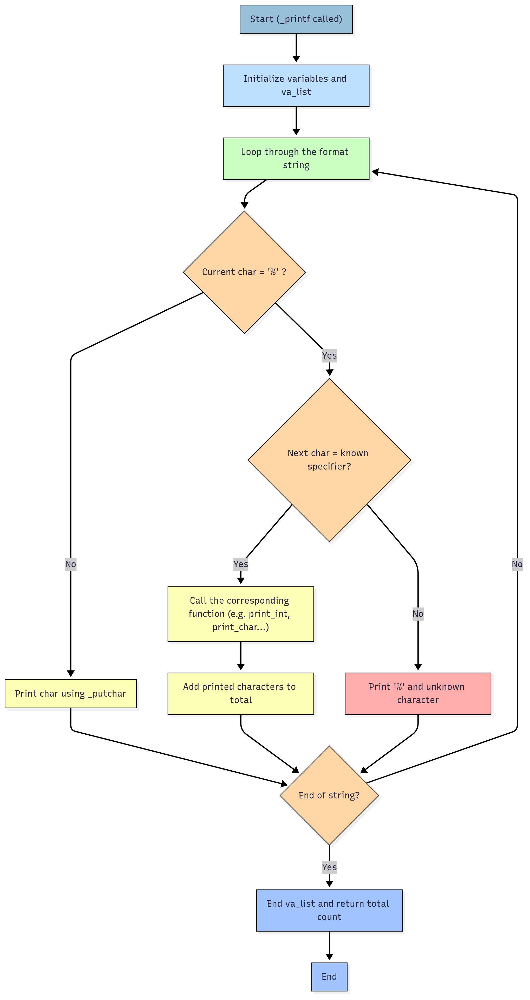

# 🖨️ holbertonschool-printf

## 📌 Description
Ce projet a été réalisé dans le cadre du cursus Holberton School.
L'objectif est de réimplémenter la fonction `printf` du langage C, afin d'apprendre à gérer les arguments variables, les chaînes de caractères, et à structurer un code modulaire.

## ✅ Fonctionnalités principales
- 📦 Affichage de texte formaté avec les spécificateurs :
  - `%c` : Affiche un caractère
  - `%s` : Affiche une chaîne
  - `%d`, `%i` : Affiche un entier signé
  - `%%` : Affiche un pourcentage

## 🗂️ Structure du projet
| Fichier         | Rôle / Contenu                              |
|-----------------|---------------------------------------------|
| `main.h`        | Prototypes + structure `format_t`           |
| `_printf.c`     | Fonction principale de formatage            |
| `func_print.c`  | Fonctions pour `%c`, `%s`, `%%`             |
| `print_int.c`   | Fonction récursive pour `%d` / `%i`         |
| `main.c`        | Tests d’utilisation                         |
| `man_3_printf`  | Documentation type man                      |

## 🚀 Getting Started
### ✅ Prerequisites
- Un compilateur C (GCC recommandé)
- Système testé sur :
  - ✅ Ubuntu 20.04+
  - ✅ macOS
  - ✅ Windows (avec WSL ou MinGW)

### 🛠️ Compilation
```sh
gcc -Wall -Werror -Wextra -pedantic *.c -o printf
```

## 💡 Exemple d’utilisation
```c
_printf("[INFO] Utilisateur : %s | Score : %d%%\n", "Alice", 98);
// Affiche : [INFO] Utilisateur : Alice | Score : 98%
```

## 🧠 Flowchart du fonctionnement de _printf


## 🧾 Explication simple du flowchart
1. 🔁 On parcourt la chaîne de format caractère par caractère.
2. Si ce n’est pas un % → on affiche normalement.
3. Si on trouve % :
   - ✅ Si le caractère suivant est un format connu : on affiche avec la bonne fonction (`print_int`, `print_char`, etc.)
   - ❌ Sinon : on affiche % puis ce caractère.
4. 📏 On compte chaque caractère affiché.
5. 🧮 On retourne ce total à la fin.
