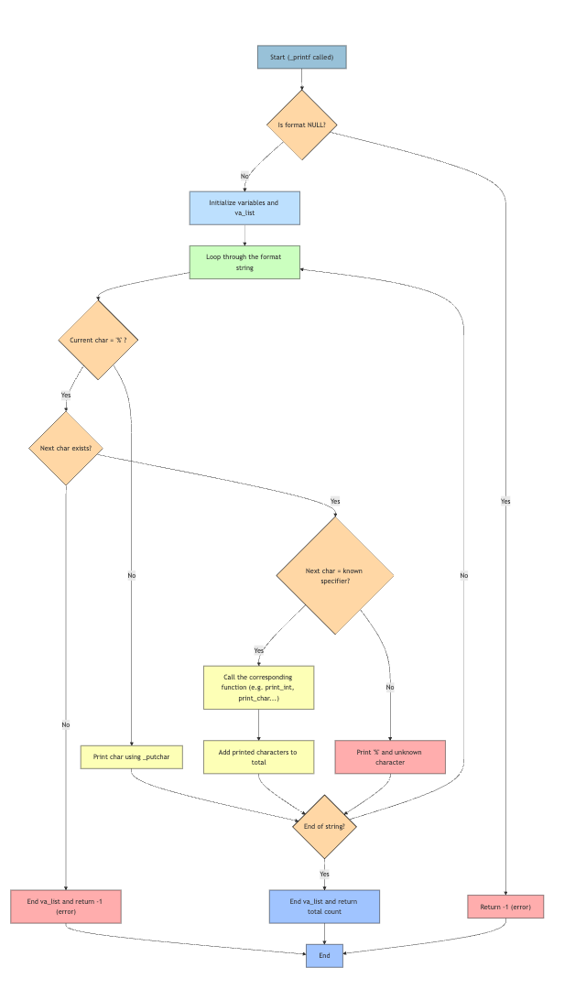

# 🖨️ holbertonschool-printf

## 📝 Présentation

Ce projet consiste à réimplémenter la fonction `_printf` du langage C.  
Il permet de manipuler :
- les arguments variables (`va_list`)
- la gestion de l’affichage formaté (`%d`, `%s`, `%c`, etc.)
- la structuration de projet modulaire en langage C

---

## ✅ Fonctionnalités prises en charge

| Spécificateur | Description                |
|---------------|----------------------------|
| `%c`          | Affiche un **caractère**   |
| `%s`          | Affiche une **chaîne**     |
| `%d`, `%i`    | Affiche un **entier signé**|
| `%%`          | Affiche un **pourcentage** |

---

## 📁 Structure du projet

```bash
holbertonschool-printf/
├── _printf.c              # Fonction principale (_printf)
├── func_print.c           # Fonctions : print_char, print_string, print_prct
├── print_int.c            # Affichage récursif des entiers (%d, %i)
├── main.c                 # Fichier de test
├── main.h                 # Déclarations & structure format_t
├── man_3_printf           # Page de documentation man (optionnelle)
├── flowchart_printf.jpeg  # Image du flowchart (_printf)
└── README.md              # Ce fichier
```

💡 Exemple d’utilisation
```c
_printf("Hello %s, you are %d years old\n", "Alice", 30);
// Affiche : Hello Alice, you are 30 years old
```


🔁 Flowchart (_printf)


```c
🧾 Logique du Flowchart
	1.	❓ Vérifier si le format est NULL
→ retourner -1 si oui.
	2.	🛠️ Initialiser les variables et la va_list.
	3.	🔁 Parcourir la chaîne de format caractère par caractère.
	4.	✏️ Si le caractère n’est pas %
→ l’afficher avec _putchar.
	5.	🔣 Si le caractère est % :
	•	❌ Si le suivant n’existe pas
→ retourner -1.
	•	✅ Si le suivant est un spécificateur connu
→ appeler la fonction correspondante et ajouter au total.
	•	🚫 Sinon
→ afficher % suivi du caractère inconnu.
	6.	🔂 Répéter jusqu’à la fin de la chaîne.
	7.	🧮 Fermer la va_list
→ retourner le nombre total de caractères affichés.
```