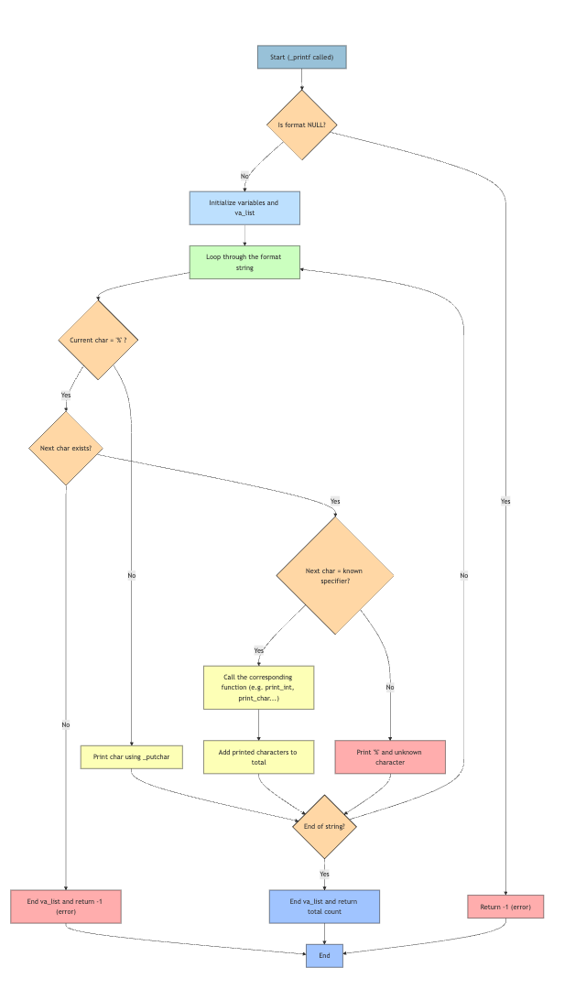

# _printf - Custom printf Function (version english)

## Description
This project implements a custom version of the standard C library `printf` function. The `_printf` function produces output according to a specified format and writes to standard output.

## Prototype
```c
int _printf(const char *format, ...);
```

## Supported Features

### Format Specifiers
- `%c` : Prints a single character
- `%s` : Prints a string
- `%d` : Prints a signed decimal integer
- `%i` : Prints a signed decimal integer (identical to %d)
- `%%` : Prints a literal '%' character

## Project Structure

```
holbertonschool-printf/
├── _printf.c          # Main _printf function
├── func_print.c       # Print functions for each type
├── main.h             # Header file with prototypes and structures
├── main.c             # Main test file
├── README.md          # Project documentation
├── man_3_printf       # Custom manual page
└── flowchart_printf   # Algorithm flowchart (to be added)
```

## Files

### `main.h`
Contains:
- Prototypes of all functions
- The `format_t` structure that associates specifiers with functions
- Necessary includes

### `_printf.c`
Main function that:
- Parses the format string
- Handles variable arguments with `va_list`
- Calls appropriate functions according to the specifier
- Returns the number of characters printed

### `func_print.c`
Contains specialized print functions:
- `_putchar()` : Writes a character to stdout
- `print_char()` : Prints a character
- `print_string()` : Prints a string
- `print_prct()` : Prints the '%' character
- `print_int()` : Prints an integer
- `print_number()` : Recursive function for number display

## Installation and Usage

```bash
# Clone and test
git clone https://github.com/adi-mart/holbertonschool-printf.git
cd holbertonschool-printf
gcc -Wall -Werror -Wextra -pedantic -std=gnu89 *.c -o printf
./printf
```

### Prerequisites
- A C compiler (GCC recommended)
- System tested on:
  - Ubuntu 20.04+
  - macOS
  - Windows (with WSL or MinGW)

### Code Example
```c
#include "main.h"

int main(void)
{
    _printf("Hello, %s!\n", "World");
    _printf("Number: %d\n", 42);
    _printf("Character: %c\n", 'A');
    _printf("Percentage: %%\n");
    return (0);
}
```

### Expected Output
```
Hello, World!
Number: 42
Character: A
Percentage: %
```

## Return Value
The `_printf` function returns:
- The number of characters printed (not counting the terminal '\0')
- `-1` in case of error (NULL format or format ending with '%')

## Error Handling

- **NULL Format** : Returns -1
- **Format ending with '%'** : Returns -1
- **Invalid specifier** : Prints '%' followed by the invalid character
- **NULL String** : Prints "(null)"

## Algorithm Flowchart

A detailed flowchart illustrating the operation of `_printf` is available. This flowchart shows:
- The format string parsing process
- Decision logic for each specifier
- Error case handling
- Return values



```c
Flowchart Logic
	1.	Check if format is NULL
→ return -1 if yes.
	2.	Initialize variables and va_list.
	3.	Loop through format string character by character.
	4.	If character is not %
→ display it with _putchar.
	5.	If character is % :
	•	If next doesn't exist
→ return -1.
	•	If next is a known specifier
→ call corresponding function and add to total.
	•	Otherwise
→ display % followed by unknown character.
	6.	Repeat until end of string.
	7.	Close va_list
→ return total number of characters displayed.
```

## Custom Manual
```

                      Library Functions Manual -  _printf

NAME
       _printf - formatted output conversion

LIBRARY
       Standard C library (libc, -lc)

SYNOPSIS
 #include <stdio.h>
    int _printf(const char *format, ...);

DESCRIPTION
    The functions in the printf() family produce output according to a
    format as described below.

    Format of the format string :
    The format string is a character string, beginning and ending in
    its initial shift state, if any. The format string is a character string composed of zero or
    more directives: ordinary characters (not %), which are
    copied unchanged to the output stream; and conversion
    specifications, each of which results in fetching zero or more
    subsequent arguments.  Each conversion specification is introduced
    by the character %, and ends with a conversion specifier.

CONVERSION SPECIFIERS
     A character that specifies the type of conversion to be applied.
       The conversion specifiers and their meanings are:

    c      Prints a single character.
            Takes an int argument and converts it to a character.

    s      Prints a string of characters.
            Takes a char * argument pointing to a null-terminated string.
            If the string is NULL, prints "(null)".

    d, i   Prints a signed decimal integer.
            Takes an int argument and converts it to decimal notation.
            Both %d and %i work identically.

    %      Prints a literal '%' character.
            No argument is consumed. Use %% to print a single %.

RETURN VALUE
    Upon successful return, these functions return the number of bytes
    printed (excluding the null byte used to end output to strings).

EXAMPLES

    #include <stdio.h>
    #include "main.h"

int main(void)
{
    _printf("Hello\n");
    _printf("%d", 39);
    _printf("%s", "This is a string");
    _printf("%c", H);

    return (0);
}

version 1.0                                                    July 2025                                                      _prinft
```

## Limitations

This implementation does not support:
- Width modifiers (ex: %10d)
- Precision modifiers (ex: %.2f)
- Floating point numbers (%f, %g, %e)
- Octal (%o) and hexadecimal (%x, %X) formats
- Unsigned formats (%u)
- Length modifiers (l, h, etc.)

## Authors
Project developed as part of the Holberton School curriculum.
By Aurélie and Mohamed

## License
This project is for educational purposes.


===============================================================================


# _printf - Fonction printf personnalisée (Version Française)

## Description
Ce projet implémente une version personnalisée de la fonction `printf` de la bibliothèque standard C. La fonction `_printf` produit une sortie selon un format spécifié et écrit vers la sortie standard.

## Prototype
```c
int _printf(const char *format, ...);
```

## Fonctionnalités supportées

### Spécificateurs de format
- `%c` : Imprime un caractère unique
- `%s` : Imprime une chaîne de caractères
- `%d` : Imprime un entier décimal signé
- `%i` : Imprime un entier décimal signé (identique à %d)
- `%%` : Imprime un caractère littéral '%'

## Structure du projet

```
holbertonschool-printf/
├── _printf.c          # Fonction principale _printf
├── func_print.c       # Fonctions d'impression pour chaque type
├── main.h             # Fichier d'en-tête avec prototypes et structures
├── main.c             # Fichier de test principal
├── README.md          # Documentation du projet
├── man_3_printf       # Page de manuel personnalisée
└── flowchart_printf   # Diagramme de flux de l'algorithme (à ajouter)
```

## Fichiers

### `main.h`
Contient :
- Les prototypes de toutes les fonctions
- La structure `format_t` qui associe les spécificateurs aux fonctions
- Les includes nécessaires

### `_printf.c`
Fonction principale qui :
- Parse la chaîne de format
- Gère les arguments variables avec `va_list`
- Appelle les fonctions appropriées selon le spécificateur
- Retourne le nombre de caractères imprimés

### `func_print.c`
Contient les fonctions d'impression spécialisées :
- `_putchar()` : Écrit un caractère vers stdout
- `print_char()` : Imprime un caractère
- `print_string()` : Imprime une chaîne de caractère
- `print_prct()` : Imprime le caractère '%'
- `print_int()` : Imprime un entier
- `print_number()` : Fonction récursive pour l'affichage des nombres


## Installation et Utilisation

```bash
# Cloner et tester
git clone https://github.com/adi-mart/holbertonschool-printf.git
cd holbertonschool-printf
gcc -Wall -Werror -Wextra -pedantic -std=gnu89 *.c -o printf
./printf

```
### Prerequisites
- Un compilateur C (GCC recommandé)
- Système testé sur :
  -  Ubuntu 20.04+
  -  macOS
  -  Windows (avec WSL ou MinGW)


### Exemple de code
```c
#include "main.h"

int main(void)
{
    _printf("Hello, %s!\n", "World");
    _printf("Number: %d\n", 42);
    _printf("Character: %c\n", 'A');
    _printf("Percentage: %%\n");
    return (0);
}
```


### Sortie attendue
```
Hello, World!
Number: 42
Character: A
Percentage: %
```

## Valeur de retour
La fonction `_printf` retourne :
- Le nombre de caractères imprimés (sans compter le '\0' terminal)
- `-1` en cas d'erreur (format NULL ou format se terminant par '%')


## Gestion des erreurs

- **Format NULL** : Retourne -1
- **Format se terminant par '%'** : Retourne -1
- **Spécificateur invalide** : Imprime '%' suivi du caractère invalide
- **String NULL** : Imprime "(null)"


## Flowchart de l'algorithme

Un diagramme de flux détaillé illustrant le fonctionnement de `_printf` est disponible. Ce flowchart montre :
- Le processus de parsing de la chaîne de format
- La logique de décision pour chaque spécificateur
- La gestion des cas d'erreur
- Le retour des valeurs


```c
Logique du Flowchart
	1.	Vérifier si le format est NULL
→ retourner -1 si oui.
	2.	Initialiser les variables et la va_list.
	3.	Parcourir la chaîne de format caractère par caractère.
	4.	Si le caractère n’est pas %
→ l’afficher avec _putchar.
	5.	Si le caractère est % :
	•	Si le suivant n’existe pas
→ retourner -1.
	•	Si le suivant est un spécificateur connu
→ appeler la fonction correspondante et ajouter au total.
	•	Sinon
→ afficher % suivi du caractère inconnu.
	6.	Répéter jusqu’à la fin de la chaîne.
	7.	Fermer la va_list
→ retourner le nombre total de caractères affichés.
```


## Manuel personnalisé
```
                Manuel des Fonctions de Bibliothèque - _printf

NOM
       _printf - conversion de sortie formatée

BIBLIOTHÈQUE
       Bibliothèque C standard (libc, -lc)

SYNOPSIS
 #include <stdio.h>
    int _printf(const char *format, ...);

DESCRIPTION
    Les fonctions de la famille printf() produisent une sortie selon un
    format comme décrit ci-dessous.

    Format de la chaîne de format :
    La chaîne de format est une chaîne de caractères, commençant et se terminant dans
    son état de décalage initial, le cas échéant. La chaîne de format est une chaîne de caractères composée de zéro ou
    plusieurs directives : caractères ordinaires (pas %), qui sont
    copiés inchangés vers le flux de sortie ; et spécifications de
    conversion, chacune résultant en la récupération de zéro ou plusieurs
    arguments suivants. Chaque spécification de conversion est introduite
    par le caractère %, et se termine par un spécificateur de conversion.

SPÉCIFICATEURS DE CONVERSION
     Un caractère qui spécifie le type de conversion à appliquer.
       Les spécificateurs de conversion et leurs significations sont :

    c      Imprime un caractère unique.
            Prend un argument int et le convertit en caractère.

    s      Imprime une chaîne de caractères.
            Prend un argument char * pointant vers une chaîne terminée par '\0'.
            Si la chaîne est NULL, imprime "(null)".

    d, i   Imprime un entier décimal signé.
            Prend un argument int et le convertit en notation décimale.
            %d et %i fonctionnent de manière identique.

    %      Imprime un caractère '%' littéral.
            Aucun argument n'est consommé. Utilisez %% pour imprimer un seul %.

VALEUR DE RETOUR
    En cas de retour réussi, ces fonctions retournent le nombre d'octets
    imprimés (excluant l'octet nul utilisé pour terminer la sortie vers les chaînes).

EXEMPLES

    #include <stdio.h>
    #include "main.h"

int main(void)
{
    _printf("Bonjour\n");
    _printf("%d", 39);
    _printf("%s", "Ceci est une chaîne");
    _printf("%c", H);

    return (0);
}

version 1.0                                                  Juillet 2025                                                    _prinft
```


## Limitations

Cette implémentation ne supporte pas :
- Les modificateurs de largeur (ex: %10d)
- Les modificateurs de précision (ex: %.2f)
- Les nombres en virgule flottante (%f, %g, %e)
- Les formats octaux (%o) et hexadécimaux (%x, %X)
- Les formats non signés (%u)
- Les modificateurs de longueur (l, h, etc.)


## Auteurs
Projet développé dans le cadre du cursus Holberton School.
Par Aurélie et Mohamed

## Licence
Ce projet est à des fins éducatives.
