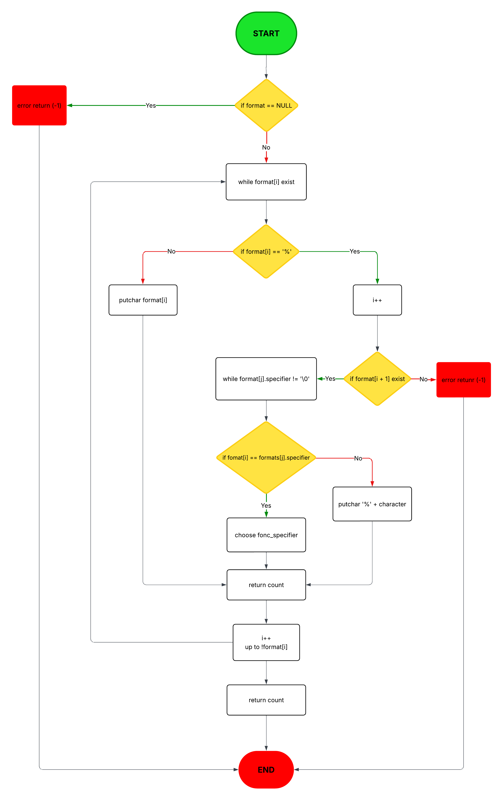
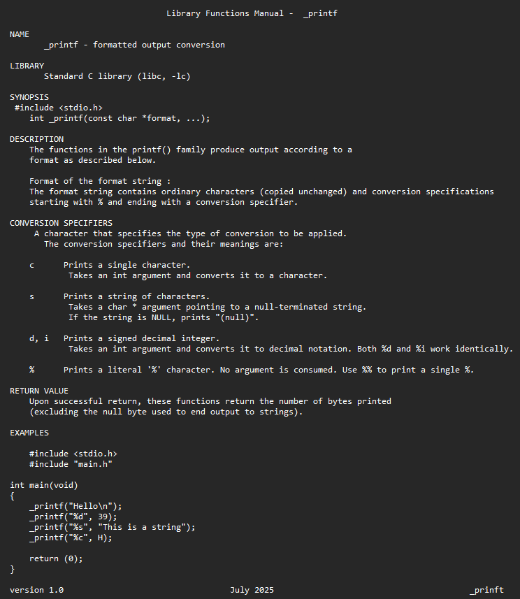

# _printf - Custom printf Function (english version )

## Description
This project implements a custom version of the standard C library `printf` function. The `_printf` function produces output according to a specified format and writes to standard output.

## Prototype
```c
int _printf(const char *format, ...);
```

## Supported Features

### Format Specifiers
- `%c` : Prints a single character
- `%s` : Prints a string
- `%d` : Prints a signed decimal integer
- `%i` : Prints a signed decimal integer (identical to %d)
- `%%` : Prints a literal '%' character

## Project Structure

| File            | Role / Content                              |
|-----------------|---------------------------------------------|
| `main.h`        | Prototypes + `format_t` structure           |
| `_printf.c`     | Main formatting function                    |
| `func_print.c`  | Functions for `%c`, `%s`, `%d`, `%i`, `%%`  |
| `_putchar.c`    | Character writing function                  |
| `man_3_printf`  | Manual page documentation                   |
| `README.md`     | Complete project documentation              |
| `image/`        | Folder containing images (flowchart)       |


## Installation and Usage

```bash
# Clone and test
git clone https://github.com/adi-mart/holbertonschool-printf.git
cd holbertonschool-printf
gcc -Wall -Werror -Wextra -pedantic -std=gnu89 *.c -o printf
./printf
```

### Prerequisites
- A C compiler (GCC recommended)
- System tested on:
  - Ubuntu 20.04+
  - macOS
  - Windows (with WSL or MinGW)

### Code Example
```c
#include "main.h"

int main(void)
{
    _printf("Hello, %s!\n", "World");
    _printf("Number: %d\n", 42);
    _printf("Character: %c\n", 'A');
    _printf("Percentage: %%\n");
    return (0);
}
```

### Expected Output
```
Hello, World!
Number: 42
Character: A
Percentage: %
```

## Return Value
The `_printf` function returns:
- The number of characters printed (not counting the terminal '\0')
- `-1` in case of error (NULL format or format ending with '%')

## Error Handling

- **NULL Format** : Returns -1
- **Format ending with '%'** : Returns -1
- **Invalid specifier** : Prints '%' followed by the invalid character
- **NULL String** : Prints "(null)"

## Algorithm Flowchart

A detailed flowchart illustrating the operation of `_printf` is available. This flowchart shows:
- The format string parsing process
- Decision logic for each specifier
- Error case handling
- Return values




## Custom Manual




## Limitations

This implementation does not support:
- Width modifiers (ex: %10d)
- Precision modifiers (ex: %.2f)
- Floating point numbers (%f, %g, %e)
- Octal (%o) and hexadecimal (%x, %X) formats
- Unsigned formats (%u)
- Length modifiers (l, h, etc.)

## Authors
Project developed as part of the Holberton School curriculum.
By Aurélie and Mohamed

## License
This project is for educational purposes.

---

<br><br><br>

---

_printf - Fonction printf personnalisée (Version Française)

## Description
Ce projet implémente une version personnalisée de la fonction `printf` de la bibliothèque standard C. La fonction `_printf` produit une sortie selon un format spécifié et écrit vers la sortie standard.

## Prototype
```c
int _printf(const char *format, ...);
```

## Fonctionnalités supportées

### Spécificateurs de format
- `%c` : Imprime un caractère unique
- `%s` : Imprime une chaîne de caractères
- `%d` : Imprime un entier décimal signé
- `%i` : Imprime un entier décimal signé (identique à %d)
- `%%` : Imprime un caractère littéral '%'

## Structure du projet

| Fichier         | Rôle / Contenu                              |
|-----------------|---------------------------------------------|
| `main.h`        | Prototypes + structure `format_t`           |
| `_printf.c`     | Fonction principale de formatage            |
| `func_print.c`  | Fonctions pour `%c`, `%s`, `%d`, `%i`, `%%` |
| `_putchar.c`    | Fonction d'écriture d'un caractère         |
| `man_3_printf`  | Documentation type man                      |
| `README.md`     | Documentation complète du projet           |
| `image/`        | Dossier contenant les images (flowchart)   |


## Installation et Utilisation

```bash
# Cloner et tester
git clone https://github.com/adi-mart/holbertonschool-printf.git
cd holbertonschool-printf
gcc -Wall -Werror -Wextra -pedantic -std=gnu89 *.c -o printf
./printf

```
### Prerequisites
- Un compilateur C (GCC recommandé)
- Système testé sur :
  -  Ubuntu 20.04+
  -  macOS
  -  Windows (avec WSL ou MinGW)


### Exemple de code
```c
#include "main.h"

int main(void)
{
    _printf("Hello, %s!\n", "World");
    _printf("Number: %d\n", 42);
    _printf("Character: %c\n", 'A');
    _printf("Percentage: %%\n");
    return (0);
}
```


### Sortie attendue
```
Hello, World!
Number: 42
Character: A
Percentage: %
```

## Valeur de retour
La fonction `_printf` retourne :
- Le nombre de caractères imprimés (sans compter le '\0' terminal)
- `-1` en cas d'erreur (format NULL ou format se terminant par '%')


## Gestion des erreurs

- **Format NULL** : Retourne -1
- **Format se terminant par '%'** : Retourne -1
- **Spécificateur invalide** : Imprime '%' suivi du caractère invalide
- **String NULL** : Imprime "(null)"


## Flowchart de l'algorithme

Un diagramme de flux détaillé illustrant le fonctionnement de `_printf` est disponible. Ce flowchart montre :
- Le processus de parsing de la chaîne de format
- La logique de décision pour chaque spécificateur
- La gestion des cas d'erreur
- Le retour des valeurs


## Manuel personnalisé


## Limitations

Cette implémentation ne supporte pas :
- Les modificateurs de largeur (ex: %10d)
- Les modificateurs de précision (ex: %.2f)
- Les nombres en virgule flottante (%f, %g, %e)
- Les formats octaux (%o) et hexadécimaux (%x, %X)
- Les formats non signés (%u)
- Les modificateurs de longueur (l, h, etc.)


## Auteurs
Projet développé dans le cadre du cursus Holberton School.
Par Aurélie et Mohamed

## Licence
Ce projet est à des fins éducatives.
