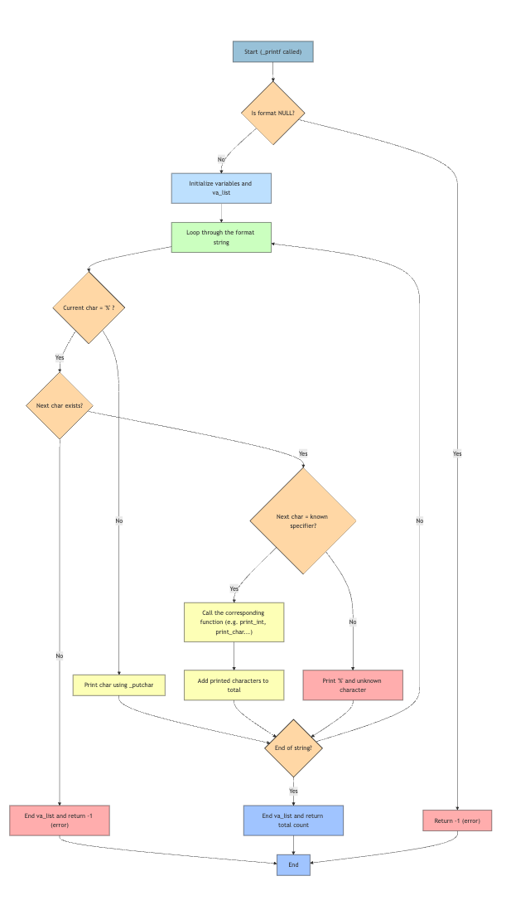

# 🖨️ holbertonschool-printf

## 📝 Présentation

Ce projet consiste à réimplémenter la fonction `_printf` du langage C.  
Il permet de manipuler :
- les arguments variables (`va_list`)
- la gestion de l’affichage formaté (`%d`, `%s`, `%c`, etc.)
- la structuration de projet modulaire en langage C

---

## ✅ Fonctionnalités prises en charge

| Spécificateur | Description                |
|---------------|----------------------------|
| `%c`          | Affiche un **caractère**   |
| `%s`          | Affiche une **chaîne**     |
| `%d`, `%i`    | Affiche un **entier signé**|
| `%%`          | Affiche un **pourcentage** |

---

## 📁 Structure du projet

```bash
holbertonschool-printf/
├── _printf.c              # Fonction principale (_printf)
├── func_print.c           # Fonctions : print_char, print_string, print_prct
├── print_int.c            # Affichage récursif des entiers (%d, %i)
├── main.c                 # Fichier de test
├── main.h                 # Déclarations & structure format_t
├── man_3_printf           # Page de documentation man (optionnelle)
├── flowchart_printf.jpeg  # Image du flowchart (_printf)
└── README.md              # Ce fichier

💡 Exemple d’utilisation
_printf("Hello %s, you are %d years old\n", "Alice", 30);
// Affiche : Hello Alice, you are 30 years old


🔁 Flowchart (_printf)



🧾 Logique du flowchart
	1.	Initialiser les variables et va_list
	2.	Parcourir la chaîne format caractère par caractère
	3.	Si ce n’est pas un %, afficher directement
	4.	Si c’est un % :
	•	Si le caractère suivant est reconnu (c, s, d, i, %) → appeler la fonction correspondante
	•	Sinon, afficher % + le caractère inconnu
	5.	Continuer jusqu’à la fin de la chaîne
	6.	Retourner le nombre total de caractères affichés

🧪 Tests

Compare toujours ton _printf avec la fonction standard printf :
int len1 = _printf("%d\n", 1234);
int len2 = printf("%d\n", 1234);
// Les deux doivent afficher 1234 et retourner la même longueur
